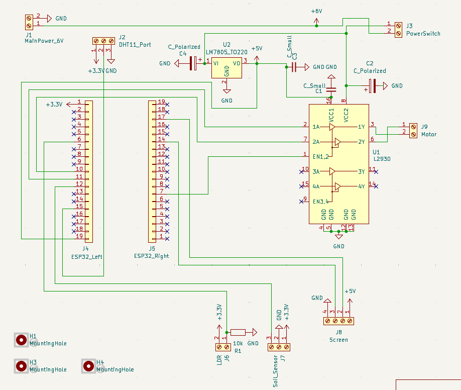
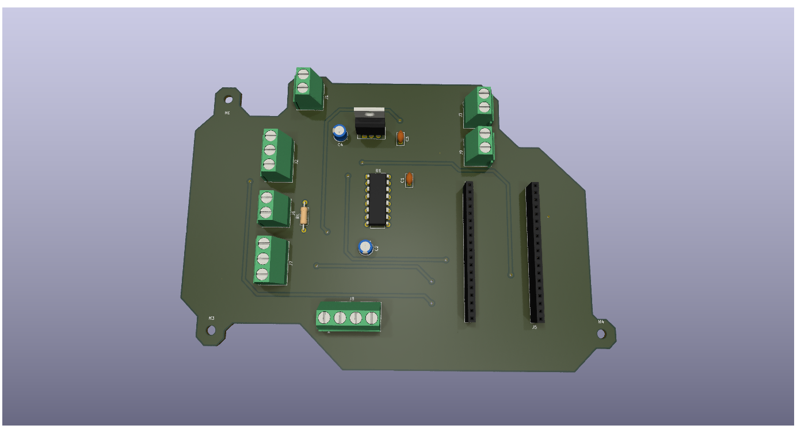
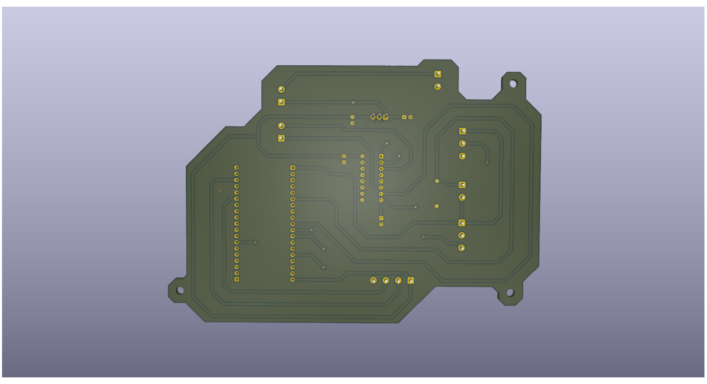

  
  
  

# Plant Monitor: A Self-Watering Plant Device

## ✨ Features
- Automated soil moisture monitoring
- Automatic watering via pump & tubing
- Temperature and humidity tracking
- Light level detection
- LCD display for real-time readings
- Battery-powered operation
---

## 🌱 About
Plant Monitor is a compact, IoT‑ready device designed to keep your plants healthy. Four environmental sensors continuously monitor soil moisture, temperature, humidity, and sunlight levels to maintain ideal growing conditions.
---

## 🔧 Hardware List
### **Sensors / Active Parts**
- **ESP32 WROOM 32E**
 Dual-core 32-bit microcontroller with Wi-Fi and Bluetooth. Runs up to 240 MHz. Ideal for this low-power IoT application.
- **Custom Printed Circuit Board**
  Custom circuit board to connect microcontroller and sensors, send signals, and manage power. Designed using KiCad software.
- **DHT11 Humiture Sensor**
 Measures both temperature (0-50 Celcius) and relative humidity using a capacitive humidity sensor. Outputs data over a single wire digital interface.
- **Capacitive Soil Moisture Module**
 Measures soil water content by sensing changes in soil capacitance. The soil acts as a dialectric between two conductors. Long-lasting, corrosion-resistant, and outputs an analog signal.
- **Centrifugal Pump**
 Small DC motor pump (.36 ~ 0.91 W). Fluid is accelerated by the impeller and flows out of an attached tube.
- **Photoresistor**
 Light-dependent resistor (LDR) that uses semiconductor material and varying resistance to measure ambient light intensity.
- **I2C LCD1602**
 16x2 character LCD with a two-wire I2C backpack used to display sensor readings.
---
### **Supporting Components**
- **Four Double A Battery Pack (x2)**
 Provides power for motor, ESP32, sensors.
- **L293D Dual Motor Driver**
 Dual H bridge driver supporting PWM output. Handles 600mA per channel and a peak current of 1.2A.
- **Jumper Wires**
 Used for connecting sensors and modules
- **Resistor**
 10k ohm resistor used for pull-up or signal conditioning.
- **Capacitors**
 Various capacitors used for decoupling. Features both ceramic and electrolytic capacitors.
- **Screw Terminals**
  Connecting PCB traces to wires connecting sensors.
---

## 📸 Photos
### 🧩 Wiring Diagram

  

### PCB Design

  
  

---

## 📄 License
This project is licensed under the MIT License.
